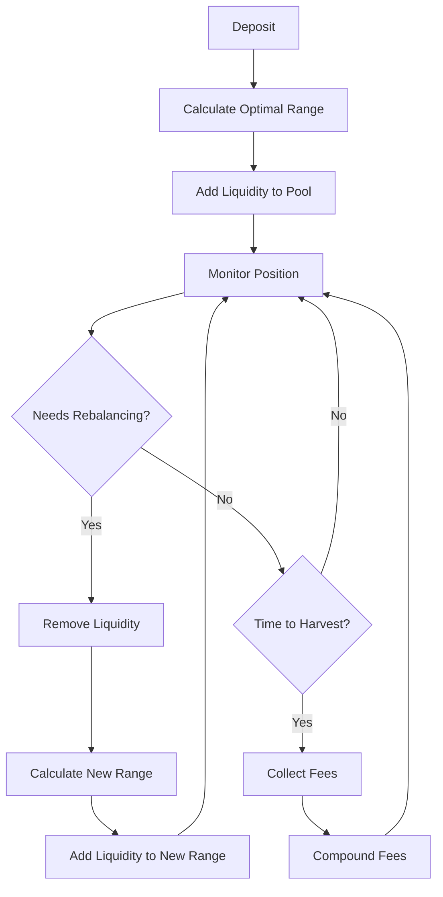

# Uniswap V4 FairFlow Stablecoin Strategy

## Overview

The UniswapV4FairFlowStablecoinStrategy is an advanced liquidity providing strategy specifically designed for stablecoin pairs in Uniswap V4. It leverages Kyber's FairFlow hook technology along with the new features of Uniswap V4, including hooks, concentrated liquidity, dynamic fees, and flash accounting to maximize yield while minimizing impermanent loss and providing MEV protection for stablecoin liquidity providers.

## Key Features

### 🎯 Concentrated Liquidity Management
- **Tight Range Optimization**: Automatically manages liquidity in narrow price ranges (typically 0.2%-1.0% around 1:1 ratio)
- **Dynamic Range Adjustment**: Adapts range width based on market volatility and conditions
- **Automated Rebalancing**: Triggers rebalancing when price moves outside optimal range

### 🔧 Kyber FairFlow Hook Integration
- **MEV Protection**: Advanced protection against Maximum Extractable Value attacks using Kyber's FairFlow technology
- **Fair Pricing Mechanism**: Ensures optimal execution prices through sophisticated algorithms
- **Custom Hook Logic**: Implements Kyber's FairFlow hooks for automated management
- **Pre/Post Transaction Logic**: Executes optimizations before and after major operations
- **Gas Optimization**: Leverages V4's singleton architecture for reduced gas costs

### 💰 Dynamic Fee Optimization
- **Market-Responsive Fees**: Adjusts fees based on volatility, volume, and liquidity conditions
- **Yield Maximization**: Optimizes fee rates to maximize LP returns
- **Real-time Adjustments**: Updates fees based on market conditions and profitability

### 🛡️ Risk Management
- **Impermanent Loss Protection**: Minimizes IL through tight range management
- **Emergency Exit Mechanisms**: Provides safety mechanisms for extreme market conditions
- **Slippage Controls**: Configurable slippage tolerance and protection

## Architecture

### Core Components

1. **UniswapV4FairFlowStablecoinStrategy.sol** - Main strategy contract
2. **StablecoinRangeManager.sol** - Library for range calculations and management
3. **FeeOptimizer.sol** - Dynamic fee calculation and optimization
4. **IUniswapV4Hook.sol** - Hook interface for V4 integration
5. **IPoolManager.sol** - Pool manager interface for V4 operations

### Strategy Flow



## Benefits for Stablecoin LPs

### 📈 Enhanced Yield Generation
- **Higher Fee Capture**: Concentrated liquidity in active trading ranges
- **Compounding Returns**: Automatic reinvestment of collected fees
- **Optimized Capital Efficiency**: Maximum utilization of deposited capital

### 🔒 Reduced Risk Profile
- **Minimal Impermanent Loss**: Stablecoin pairs have inherently low IL risk
- **Tight Range Management**: Further reduces IL through precise range control
- **Emergency Protections**: Built-in safety mechanisms for extreme scenarios

### ⚡ Operational Efficiency
- **Automated Management**: No manual intervention required for optimal performance
- **Gas Optimization**: Leverages V4's efficiency improvements
- **Real-time Optimization**: Continuous adjustment to market conditions

## Integration Guide

### Prerequisites

1. **Foundry Setup**
```bash
curl -L https://foundry.paradigm.xyz | bash
foundryup
```

2. **Dependencies**
```bash
forge install OpenZeppelin/openzeppelin-contracts
forge install foundry-rs/forge-std
```

### Deployment

1. **Deploy Supporting Contracts**
```solidity
// Deploy mock contracts for testing
MockUniswapV4PoolManager poolManager = new MockUniswapV4PoolManager();
MockUniswapV4Hook hook = new MockUniswapV4Hook();

// Setup pool key
PoolKey memory poolKey = PoolKey({
    currency0: address(usdc),
    currency1: address(usdt),
    fee: 500, // 0.05%
    tickSpacing: 10,
    hooks: address(hook)
});
```

2. **Deploy Strategy**
```solidity
UniswapV4FairFlowStablecoinStrategy strategy = new UniswapV4FairFlowStablecoinStrategy(
    address(usdc),           // Primary asset
    address(usdt),           // Paired asset
    address(vault),          // Abunfi vault
    address(poolManager),    // V4 pool manager
    address(hook),           // Custom hook
    "USDC/USDT V4 Strategy", // Strategy name
    poolKey                  // Pool configuration
);
```

3. **Configure Strategy**
```solidity
// Set range configuration
strategy.updateRangeConfig(
    50,      // 0.5% range width
    25,      // 0.25% rebalance threshold
    1000e6,  // 1000 USDC minimum liquidity
    true     // Enable auto-rebalancing
);

// Update market conditions
strategy.updateMarketConditions(
    25,        // 0.25% volatility
    1000000e6, // 1M USDC daily volume
    10,        // 0.1% spread
    5000000e6  // 5M USDC total liquidity
);
```

### Integration with Abunfi Vault

1. **Add Strategy to Vault**
```solidity
// In AbunfiVault.sol
function addStrategy(address _strategy, uint256 _allocation) external onlyOwner {
    strategies.push(IAbunfiStrategy(_strategy));
    strategyAllocations[_strategy] = _allocation;
    isActiveStrategy[_strategy] = true;
}
```

2. **Configure Allocation**
```solidity
// Set strategy allocation (e.g., 20% of vault assets)
vault.addStrategy(address(strategy), 2000); // 20% in basis points
```

### Usage Examples

#### Basic Deposit and Withdrawal
```solidity
// Deposit to strategy (called by vault)
strategy.deposit(10000e6); // 10,000 USDC

// Harvest fees
uint256 yield = strategy.harvest();

// Withdraw partial amount
strategy.withdraw(5000e6); // 5,000 USDC

// Withdraw all
strategy.withdrawAll();
```

#### Advanced Configuration
```solidity
// Update range for different market conditions
if (highVolatility) {
    strategy.updateRangeConfig(100, 50, 500e6, false); // Wider range, manual rebalancing
} else {
    strategy.updateRangeConfig(20, 15, 1000e6, true);  // Tight range, auto-rebalancing
}

// Manual rebalancing
strategy.manualRebalance();

// Emergency exit
if (extremeConditions) {
    strategy.emergencyExit();
}
```

## Configuration Parameters

### Range Configuration
- **rangeWidth**: Width of liquidity range in basis points (20-100 typical)
- **rebalanceThreshold**: Price movement threshold to trigger rebalancing
- **minLiquidity**: Minimum liquidity required for operations
- **autoRebalance**: Enable/disable automatic rebalancing

### Fee Configuration
- **baseFee**: Base fee rate for the pool
- **volatilityMultiplier**: Adjustment factor for volatility-based fee changes
- **volumeThreshold**: Volume threshold for fee adjustments
- **updateFrequency**: How often to update fees
- **dynamicEnabled**: Enable/disable dynamic fee adjustments

### Risk Management
- **maxSlippage**: Maximum acceptable slippage (default: 1%)
- **emergencyExitThreshold**: IL threshold for emergency exit (default: 5%)
- **emergencyMode**: Emergency mode flag

## Monitoring and Analytics

### Key Metrics
- **Total Assets**: Current value of assets under management
- **Total Fees Claimed**: Cumulative fees collected
- **Rebalance Count**: Number of rebalancing operations
- **Current APY**: Estimated annual percentage yield
- **Impermanent Loss**: Current IL percentage
- **Position Utilization**: Percentage of liquidity in active range

### View Functions
```solidity
// Get current position info
(int24 tickLower, int24 tickUpper, uint128 liquidity, uint256 lastUpdate, bool isActive) = 
    strategy.getCurrentPosition();

// Get strategy statistics
(uint256 totalDeposited, uint256 totalFeesClaimed, uint256 rebalanceCount, 
 uint256 lastHarvestTime, uint256 lastRebalanceTime, bool emergencyMode) = 
    strategy.getStrategyStats();

// Get current impermanent loss
uint256 il = strategy.getCurrentImpermanentLoss();

// Get estimated APY
uint256 apy = strategy.getAPY();
```

## Testing

### Running Tests
```bash
# Run all tests
forge test

# Run specific test file
forge test --match-path test/UniswapV4FairFlowStablecoinStrategy.t.sol

# Run with verbosity
forge test -vvv

# Run specific test function
forge test --match-test test_Deposit
```

### Test Coverage
The test suite covers:
- ✅ Basic functionality (deposit, withdraw, harvest)
- ✅ Range management and rebalancing
- ✅ Fee optimization scenarios
- ✅ Emergency mechanisms
- ✅ Access control and security
- ✅ Integration with Abunfi ecosystem
- ✅ Edge cases and stress testing
- ✅ Library function testing

## Security Considerations

### Access Control
- Only vault can call deposit/withdraw functions
- Only owner can call administrative functions
- Emergency functions have appropriate restrictions

### Reentrancy Protection
- All external calls protected with ReentrancyGuard
- State changes before external calls
- Proper checks-effects-interactions pattern

### Input Validation
- Amount validation for all operations
- Range validation for configuration parameters
- Slippage protection for all trades

### Emergency Mechanisms
- Emergency exit functionality
- Pause mechanisms for extreme conditions
- Owner-controlled safety overrides

## Gas Optimization

### Uniswap V4 Benefits
- **Singleton Architecture**: Single contract manages all pools
- **Flash Accounting**: Efficient balance tracking
- **Native ETH Support**: No wrapping/unwrapping overhead
- **Hook Efficiency**: Custom logic without external calls

### Strategy Optimizations
- Batch operations where possible
- Efficient data structures
- Minimal external calls
- Optimized rebalancing logic

## Future Enhancements

### Planned Features
- **Multi-Pool Support**: Support for multiple stablecoin pairs
- **Advanced Hooks**: More sophisticated hook implementations
- **MEV Protection**: Integration with MEV protection mechanisms
- **Cross-Chain Support**: Extension to other chains with V4

### Research Areas
- **Machine Learning**: ML-based range optimization
- **Oracle Integration**: Enhanced price feed integration
- **Yield Farming**: Integration with additional yield sources
- **Insurance**: IL insurance mechanisms

## Support and Resources

### Documentation
- [Uniswap V4 Documentation](https://docs.uniswap.org/contracts/v4/overview)
- [Abunfi Platform Documentation](./README.md)
- [Foundry Book](https://book.getfoundry.sh/)

### Community
- [Uniswap Discord](https://discord.gg/uniswap)
- [Abunfi Community](https://github.com/hadv/abunfi-contracts)

### Support
For technical support or questions about the strategy implementation, please:
1. Check the documentation and test files
2. Review existing issues in the repository
3. Create a new issue with detailed information
4. Contact the development team

---

*This strategy is designed for sophisticated users and should be thoroughly tested before production deployment. Always conduct proper due diligence and risk assessment.*
